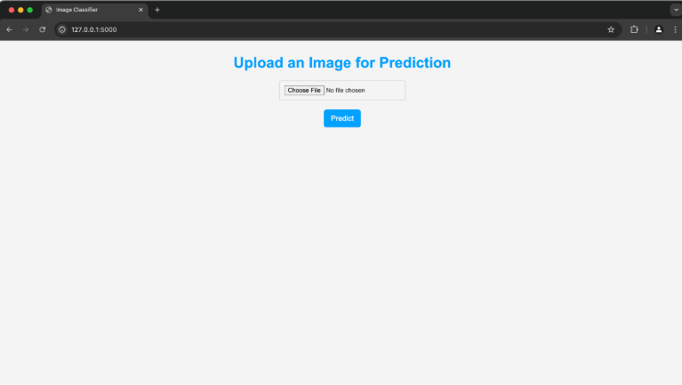
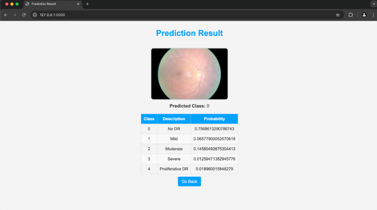

# Diabetic-Retinopathy-Scanner

The diabetic retinopathy detection used to requires an optometrist to examinate and diagnose. <br/>
With the estimated number of adults with DR is about to breach 100 million globally by 2045, a fast and cost-efficient way of DR detection is required. <br/>
Our project aims to detecte DR with machine learning, an accurate model that helps to diagnose a large portion of samples.

## Video/demo/GIF

Video link: https://drive.google.com/file/d/1z-kei8gb_9Wv5IXZhWu7i5gpurOFSgq8/view

## Table of Contents
1. [Demo](#demo)

2. [Installation](#installation)

3. [Reproducing this project](#repro)

<a name="demo"></a>

### What to find where

Expected project structure:

```
.
├── LICENSE
├── README.md
├── requirements.txt
├── resNet_model.keras
├── data
│   ├── test
│   ├── train
│   ├── new_trainLabels.csv
│   └── trainLabels.csv
└── src
    ├── CNN_Architecture.py
    ├── create_duplicates.py
    ├── dataDownload.py
    ├── dataExtraction.py
    ├── data_preview.py
    ├── evaluate.py
    ├── model.py
    ├── resNet_50.py
    ├── resNet_history.csv
    ├── test.py
    ├── trained_resNet_history.csv
    └── web
        ├── README.md
        ├── app.py
        ├── requirements.txt
        ├── static
        │   ├── css
        │   │   ├── index_styles.css
        │   │   └── result_styles.css
        │   └── js
        │       └── index_script.js
        └── templates
            ├── index.html
            └── result.html
```

There should also be 2 virtual environments, not shown here:
1. Inside `./src`: this is the virtual environment for preprocessing and training.
2. Inside `./src/web`: this is the virtual environment for the web application.

Note that the `./src/web/resNet_model.keras` needs to be generated first and does not come with the repository. This is the trained model that the web application uses to make inferences.

Also note that the `./data` directory doesn't exist and needs to be created with the data downloaded.

<a name="installation"></a>

## 2. Installation

Training dataset download link: https://drive.google.com/file/d/1FT7KUvaJIzWGg1ues0mM-gBzWs8lVol0/view?usp=drive_link <br/>
Test dataset download link: https://drive.google.com/file/d/1V5-bgGOnERDH1sYFWbVPN9qxdNUF3llp/view?usp=drive_link<br/>
Model download link: https://drive.google.com/file/d/19HdSm1qmdAaPR9pPz44kdx2EAgIspsdo/view?usp=drive_link <br/>

Initial set up:
```bash
git clone https://github.com/Tillloo/Diabetic-Retinopathy-Scanner.git
cd 2024_3_project_12

# Create virtual environment
python3 -m venv venv

# Activate virtual environment
source venv/bin/activate

# Install dependencies
pip install -r requirements.txt

## Copy keras model to web folder
cd ..
cp ../resNet_50.keras .
mv ./resNet_50.keras ./web
```

Download data:
```bash
python3 ./src/dataDownload.py
```

<a name="repro"></a>
## 3. Reproduction

```bash
## Model Training
python3 ./src/create_duplicates.py
python3 ./src/resNet_50.py
# Training Data can be found at /data/train 
# Testing Data can be found at /data/test 
# Output will be saved in new_resNet_50.keras

## If you want to train the model we defined
python3 ./src/CNN_Architecture.py
## The trained model will be saved as resNet_model.keras

```

```bash
### Model Evaluation

# Prediction can be found at result.csv with last column with column name "level"
```
```bash
### Data preview
python3 data_preview.py
```

## Web application

### Home page

This page allows the user to submit a picture for the model to predict the class of for diabetic retinopathy.

### Result page

This page shows the probabilities predicted by the model that the user-submitted image is any particular class.
